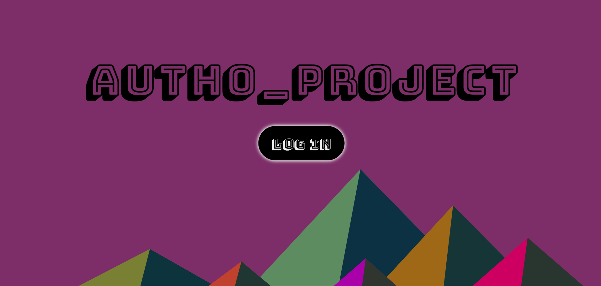
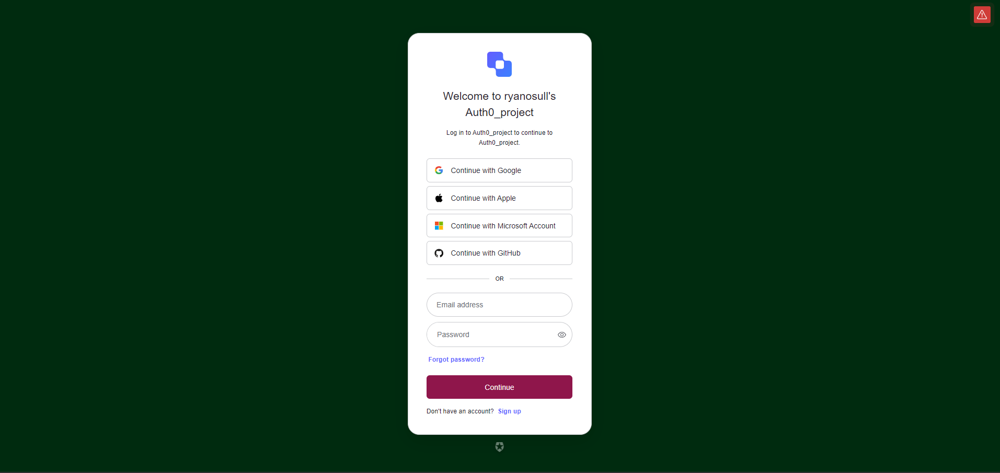
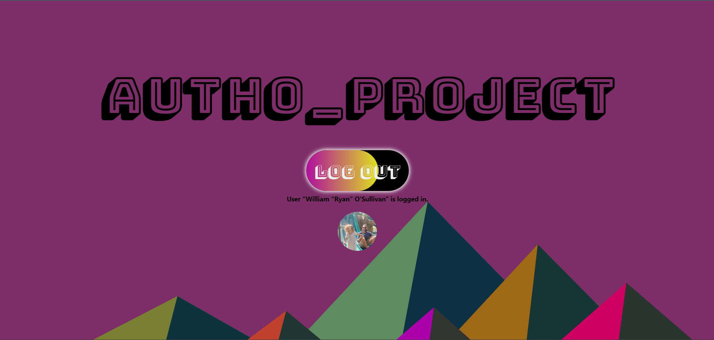

# README

For now, this is only the frontend implementation. Will send info to backend next. Link the blog post.

## Screenshots

<!-- still need logout screenshot with user info -->

## Styles
- keen eye will notice irish green and ruby stone(aka star) red from https://www.backdrophome.com/pages/porsche/
    - https://imagecolorpicker.com/en used to define hex value from above paint sample
- https://dev.to/webdeasy/top-20-css-buttons-animations-f41 and https://uiverse.io/buttons# button inspo
- https://coolors.co/ff6666-ccff66-5d2e8c-2ec4b6-f1e8b8 to pick color pallettes for SVG background
- https://www.svgbackgrounds.com/set/free-svg-backgrounds-and-patterns/
- https://fonts.google.com/specimen/Bungee+Shade?query=bungee+shade google fonts

## Usage

To use Auth0_project, follow these steps:

1. Clone the repository to your local machine

2. Open a terminal and navigate to the project directory.

3. Install the required ruby dependencies by running `bundle install`.

4. In a seperate terminal, navigate to the client folder and run `npm install` to install React dependencies.

5. Start the development server by running `npm start` in the terminal.

6. Open your browser and visit http://localhost:4000 to access the app.

Things you may want to cover:

* Ruby version

* System dependencies

* Configuration

* Database creation

* Database initialization

* How to run the test suite

* Services (job queues, cache servers, search engines, etc.)

* Deployment instructions

* ...
